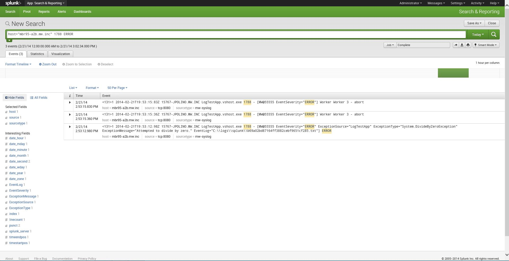
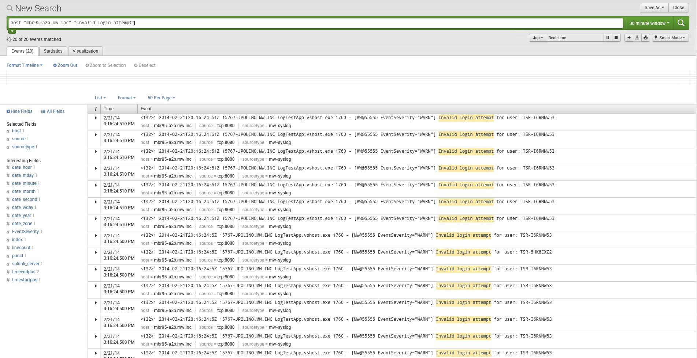
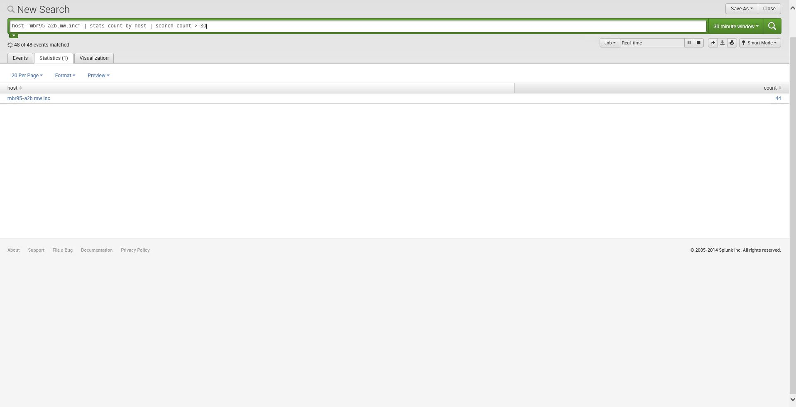

#Intro

[Log4net](http://logging.apache.org/log4net/) is the defacto logging standard for the Microsoft .NET runtime. Logging frameworks like log4net enable developers to record events in their application, providing an audit trail that can be used to understand the system’s activity and diagnose problems.

[Syslog](http://en.wikipedia.org/wiki/Syslog), on the other hand, is an [IETF](http://www.ietf.org/) standard for message logging. Syslog can be used for computer system management and security auditing as well as generalized informational, analysis, and debugging messages.  With Syslog, software applications and physical devices like printers and routers can send logging information to a centralized logging server. Because of this, syslog can be used to integrate log data from many different types of systems into a central repository.

[Merchant Warehouse’s](http://www.merchantwarehouse.com/) syslog4net extension bridges that missing link between log4net and Syslog, allowing your .NET applications to send application-level telemetry into a centrally managed operational intelligence solution, such as Splunk. By monitoring and analyzing everything from customer clickstreams and transactions to network activity and call records, [Splunk](http://www.splunk.com/) helps Merchant Warehouse turn our machine data into valuable insights. With this data flowing into Splunk, we can troubleshoot problems and investigate security incidents in minutes, not hours or days. We monitor our end-to-end infrastructure to avoid service degradation or outages. And we gain real-time visibility into customer experience, transactions and behavior.

And with our syslog4net adapter, you can do all that too.

#How it works

syslog4net works by creating a custom [log4net layout](https://logging.apache.org/log4net/release/sdk/log4net.Layout.PatternLayout.html) that writes messages in [Syslog’s RFC5424 standard format](http://tools.ietf.org/html/rfc5424). You can then hook that up to any [log4net appender](https://logging.apache.org/log4net/release/sdk/log4net.Appender.html). You can write to a Syslog daemon, such as Splunk, pretty easily by connecting our SyslogLayout class to [log4net’s UdpAppender](https://logging.apache.org/log4net/release/sdk/log4net.Appender.UdpAppender.html) or our custom TcpAppender.

Those of you familiar with log4net and syslog already know that you can send any old log4net message to a syslog daemon using the UdpAppender today. But by using messages conforming to the RFC5424 standard, you get additional telemetry about:
* Your application’s name & process ID
* The host name or IP address that it was running on
* A time stamp, always guaranteed to be in UTC
* Access to structured data, tied to [log4net’s contexts](http://logging.apache.org/log4net/release/manual/contexts.html)

Having access to the structured data really is the killer feature. Log4net’s contexts give you the ability to push any (key, value) pair onto a global or thread-based scope. This information will be appended to each log entry, automatically, for you by our adapter.

For Merchant Warehouse, we use this to record various metadata about each of our transactions. An edge service (such as [Netflix Zuul](https://github.com/Netflix/zuul)) stamps a correlation ID onto each incoming request (eg: by injecting a HTTP header or SOAP header into the packet). Each component in our Service Oriented Architecture pulls down that correlation ID, and pushes it into a ThreadLogicalContext. We also push other metadata onto the context, such as a Merchant ID or Genius Device serial number. All this information gets emitted as part of each log message. When we make a call to another service in our SOA, we push that Correlation ID and other info into a message header. That way, we can tell that separate activities in disparate services are all related to a single originating transaction, and use Splunk to quickly search for (and cross reference) all of this information.

We do this by mapping log4net’s Context Properties (“MDC”) onto Syslog’s Structured Data section, and by mapping log4net’s Context Stack (“NDC”) onto Syslog’s Message Id field.

As a bonus feature, our adapter intelligently logs exceptions to syslog. Information about the exception’s source, .NET class type, message, and help link are logged to Syslog’s Structured Data section. The exception – including its message, stack trace and any inner exceptions – is logged locally, and a link to the exception’s URI is also included in the Structured Data. This allows you to have access to vital debugging information without cluttering your logs.

#Documentation

## Configuration
```xml
<!-- log to a remote syslog server, such as splunk -->
<appender name="TcpAppender" type="syslog4net.Appender.TcpAppender, syslog4net">
      <remoteAddress value="10.233.114.35" />
      <remotePort value="8080" />
      <filter type="syslog4net.Filter.LogExceptionToFileFilter, syslog4net">
            <exceptionLogFolder value="C:\Users\dominicl\Desktop\log4net\common-diagnostics\src\example\syslog4net\LogTestApp\bin\Debug\exceptions"/>
      </filter>
      <layout type="syslog4net.Layout.SyslogLayout, syslog4net">
            <structuredDataPrefix value="MW@55555"/>
      </layout>
</appender>  

<!-- log to a local file -->
<appender name="RollingFileAppender" type="log4net.Appender.RollingFileAppender">
      <file value="mylogfile.txt" />
      <appendToFile value="true" />
      <rollingStyle value="Size" />
      <maxSizeRollBackups value="5" />
      <maximumFileSize value="10MB" />
      <staticLogFileName value="true" />
      <filter type="syslog4net.Filter.LogExceptionToFileFilter, syslog4net">
            <exceptionLogFolder value="C:\Users\dominicl\Desktop\log4net\common-diagnostics\src\example\syslog4net\LogTestApp\bin\Debug\exceptions"/>
      </filter>
      <layout type="syslog4net.Layout.SyslogLayout, syslog4net">
            <structuredDataPrefix value="MW@55555"/>
      </layout>
</appender>
```

## Example code
Check out our simple [Hello World](https://github.com/merchantwarehouse/syslog4net/blob/master/src/example/syslog4net/LogTestApp/Program.cs) logging example and its corresponding [log4net XML config](https://github.com/merchantwarehouse/syslog4net/blob/master/src/example/syslog4net/LogTestApp/App.config).

## Example output
```python
<134>1 2014-01-20T13:58:58:98Z MW-DLACHOWICZ.MW.INC ConsoleApp.vshost.exe 10768 - [MW@55555 EventSeverity="INFO"] Application [ConsoleApp] Start
<135>1 2014-01-20T13:58:59:04Z MW-DLACHOWICZ.MW.INC ConsoleApp.vshost.exe 10768 - [MW@55555 EventSeverity="DEBUG"] This is a debug message
<131>1 2014-01-20T13:58:59:05Z MW-DLACHOWICZ.MW.INC ConsoleApp.vshost.exe 10768 - [MW@55555 EventSeverity="ERROR" ExceptionSource="ConsoleApp" ExceptionType="System.ArithmeticException" ExceptionMessage="Failed in Goo. Calling Foo. Inner Exception provided" EventLog="file:///C:/Users/dominicl/AppData/Local/Temp/7b56f81a-0144-457b-9f9c-c246ca2e48dd.txt"] Exception thrown from method Bar
<131>1 2014-01-20T13:58:59:07Z MW-DLACHOWICZ.MW.INC ConsoleApp.vshost.exe 10768 - [MW@55555 EventSeverity="ERROR"] Hey this is an error!
<132>1 2014-01-20T13:58:59:07Z MW-DLACHOWICZ.MW.INC ConsoleApp.vshost.exe 10768 NDC_Message [MW@55555 EventSeverity="WARN"] This should have an NDC message
<132>1 2014-01-20T13:58:59:07Z MW-DLACHOWICZ.MW.INC ConsoleApp.vshost.exe 10768 NDC2 [MW@55555 auth="auth-none" EventSeverity="WARN"] This should have an MDC message for the key 'auth'
<132>1 2014-01-20T13:58:59:07Z MW-DLACHOWICZ.MW.INC ConsoleApp.vshost.exe 10768 NDC2 [MW@55555 auth="auth-none" foo="foo-none\]\"" EventSeverity="WARN"] This should have an MDC message for the key 'auth' and 'foo-none'
<132>1 2014-01-20T13:58:59:08Z MW-DLACHOWICZ.MW.INC ConsoleApp.vshost.exe 10768 - [MW@55555 auth="auth-none" foo="foo-none\]\"" thread-prop="thread prop" EventSeverity="WARN"] See the NDC has been popped of! The MDC 'auth' key is still with us.
<134>1 2014-01-20T13:58:59:08Z MW-DLACHOWICZ.MW.INC ConsoleApp.vshost.exe 10768 - [MW@55555 auth="auth-none" foo="foo-none\]\"" thread-prop="thread prop" EventSeverity="INFO"] Application [ConsoleApp] End
```

# Using it with Splunk

Just point your TCP or UDP log4net appender using our SyslogLayout to your favorite Splunk server. That's really all that's required.

## Grepping for errors

Here, we can see all of the errors logged by a particular process. You can also see how syslog4net saves your exception data as part of Syslog's Structured Data Block.



## Viewing the number of invalid login attempts

Here, we see Splunk querying for all invalid login attempts.



## Defining an alert

Below, we have defined an alert - if there are more than 30 failed login attempts in the past 30 minutes, this alert will trigger. You can hook this up to an alert management solution such as [PagerDuty](http://www.pagerduty.com/) or [OpsGenie](http://www.opsgenie.com/).



#Downloading / Installation

Currently, syslog4net is only available as a source download. If you’d like to provide a Nuget package, that'd be very welcome.

# Contributing

We love contributions! Please send [pull requests](https://help.github.com/articles/using-pull-requests) our way. All that we ask is that you please include unit tests with all of your pull requests.

# Getting help

We also love bug reports & feature requests. You can file bugs and feature requests in our Github Issue Tracker. Please consider including the following information when you file a ticket:
* What version you're using
* What command or code you ran
* What output you saw
* How the problem can be reproduced. A small Visual Studio project zipped up or code snippet that demonstrates or reproduces the issue is always appreciated.

You can also always find help on the [syslog4net Google Group](https://groups.google.com/forum/#!forum/syslog4net).
